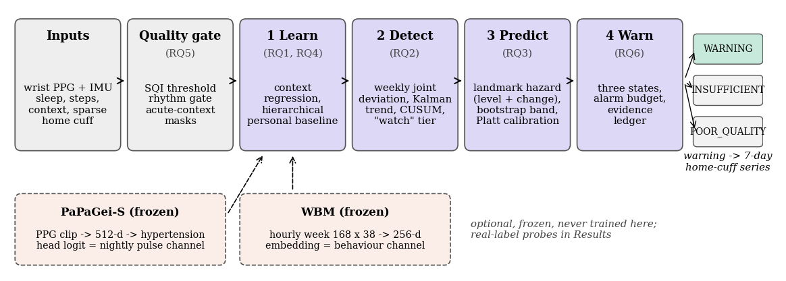
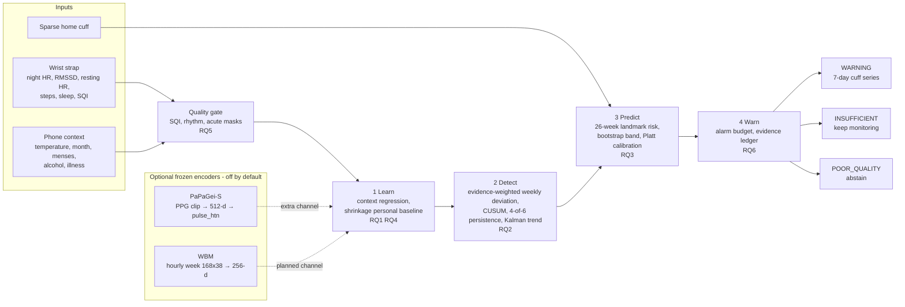
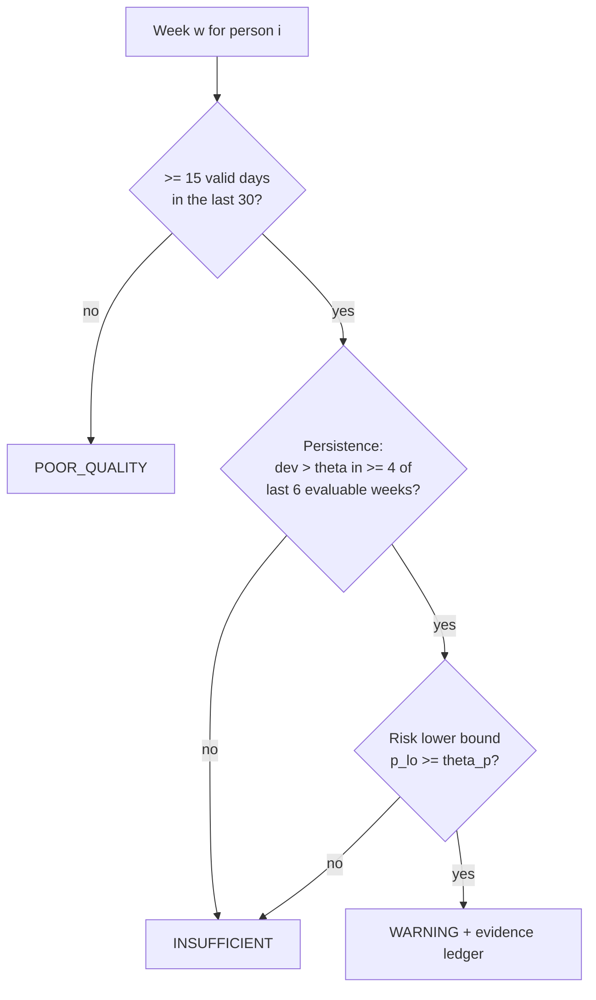
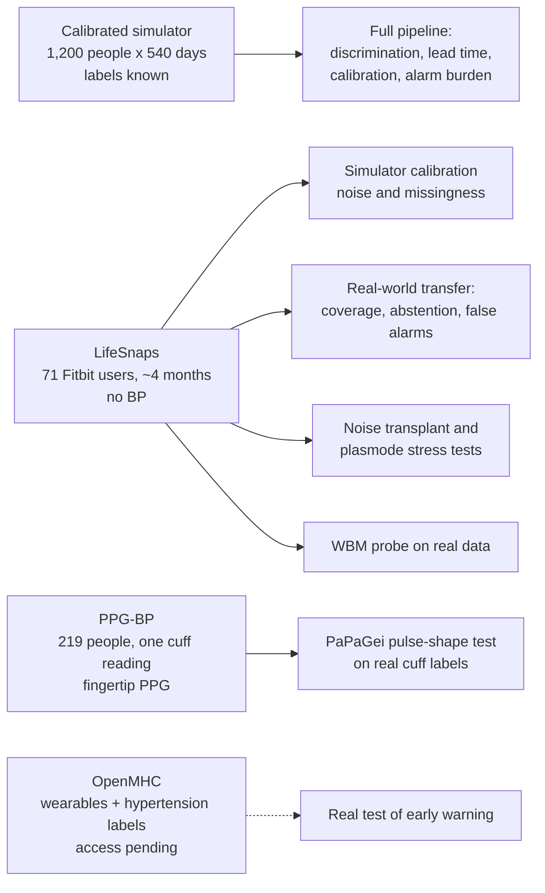
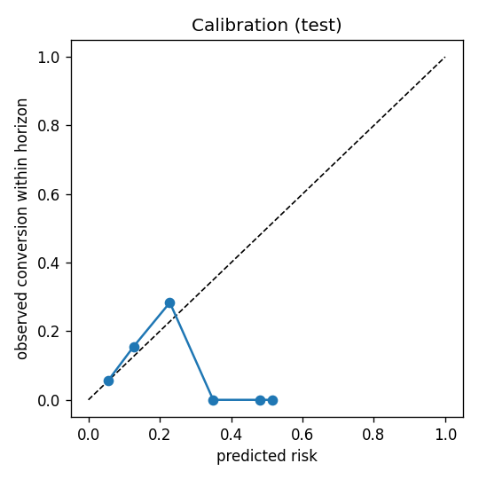
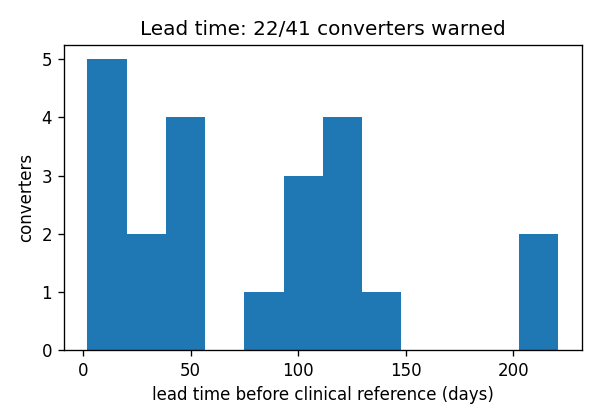

# SENTINEL-HTN

Personalised, uncertainty-aware early warning of emerging hypertension from a single wrist strap (AIoT), with
pluggable frozen wearable foundation models. Built for the BioVance AIoT Challenge (IEEE EMBS Tunisia).

## The problem

The challenge asks whether longitudinal multimodal wearable data can show a person drifting from their own baseline
toward hypertension **before clinical detection**. The signals are noisy, individual, context-dependent and often
missing, and an early but unreliable warning is not useful. So the system must follow

`X(1:t) -> personal baseline -> change -> trajectory -> early warning`

and report a risk estimate, an early-warning time, its uncertainty, the evidence behind it and a data-quality
assessment. The clinical reference `t_ref` is the first of two consecutive home-cuff (HBPM) occasions averaging
>= 130 systolic or >= 80 diastolic. The system never outputs a blood-pressure number: a warning means "measure with a
cuff for a week".

## Architecture





| Stage | File | Research question | What it does |
|---|---|---|---|
| Learn | `sentinel/learn.py` | RQ1 personalisation, RQ4 context | quality gate; regress out slow context (temperature, season, menses); mask acute context (exercise, alcohol, illness); normal-normal shrinkage baseline per person, restarted on a firmware change; clipped z-scores |
| Detect | `sentinel/detect.py` | RQ2 temporal reasoning, RQ4 | weekly joint deviation weighted by evidence prior x label-free reliability; CUSUM; persistence rule (4 of the last 6 evaluable weeks); Kalman local-linear trend. Missing weeks are "not evaluable", never negative |
| Predict | `sentinel/predict.py` | RQ3 early detection | landmark-week ridge logistic risk of conversion within 26 weeks (each person weighs one), 20 person-level bootstrap refits for the band, Platt calibration with a non-negative slope; null comparators `level_only`, `cuff_only` |
| Warn | `sentinel/warn.py` | RQ6 uncertainty, evidence | three-state decision with abstention; persistence "watch" tier (2 episodes/person-year) confirmed by the risk gate tuned to 0.5 alarms per non-converter person-year; per-decision evidence ledger |
| Evaluate | `sentinel/evaluate.py`, `run.py` | RQ5 reliability | metrics A-F, chance floor at the model's own alarm rate, ablations, robustness, fairness by skin tone |

`sentinel/data.py` holds the synthetic cohort (calibrated to LifeSnaps), the CSV loader and the perturbations. The
interfaces are fixed in `CONTRACT.md`.

### The three states

| State | Meaning |
|---|---|
| `WARNING` | sufficient evidence: the calibrated risk lower bound clears the threshold **and** the deviation is persistent |
| `INSUFFICIENT` | no reliable conclusion; keep monitoring |
| `POOR_QUALITY` | too few valid days in the last 30; any warning is suppressed |

There is no "stable" state: absence of a warning is not a claim of health.



### Optional foundation-model encoders

Both are frozen (never trained here), enter Learn as ordinary channels, and are **off by default**: the core runs
unchanged without them and never imports torch.

- **PaPaGei-S** (`sentinel/pulse.py`): PPG clip -> 512-d embedding -> hypertension head -> nightly `pulse_htn` channel
  (evidence prior 0.5: cross-sectional evidence only).
- **WBM** from OpenMHC (`sentinel/wbm.py`): hourly week of 19 phone/watch channels plus missingness flags (168 x 38)
  -> 256-d. Probed on real LifeSnaps data; its drift channel is planned, not yet in the pipeline.

## Data and validation

No public dataset follows the same people with wearables until a hypertension diagnosis, so each dataset answers
only the question it can answer honestly:



## Results

Held-out results on the calibrated simulator (3 seeds x 1,200 people x 540 days, mean ± SD):

| Model | AUROC | AUPRC | Se30 | Se90 | Alarms/py |
|---|---|---|---|---|---|
| **Full** | **0.621 ± 0.014** | **0.120 ± 0.020** | **0.322 ± 0.051** | 0.161 ± 0.072 | 0.405 |
| Equal channel weights | 0.605 | 0.104 | 0.248 | 0.105 | 0.360 |
| Level-only (null) | 0.537 | 0.070 | 0.124 | 0.083 | 0.174 |
| Cuff-only (null) | 0.545 | 0.074 | 0.149 | 0.099 | 0.236 |
| No personalisation | 0.567 | 0.083 | 0.190 | 0.120 | 0.372 |
| No context | 0.550 | 0.078 | 0.193 | 0.138 | 0.357 |
| Chance (random alarms at the model's rate) | | | 0.257 | 0.206 | 0.405 |

Se30/Se90 = converters first warned >= 30/90 days before `t_ref`; alarms per non-converter person-year.

- **Early detection:** beats chance at 30 days in every seed; **not** at 90 days. Median lead 61 days.
- **Calibration:** Brier 0.059, ECE 0.006.
- **False-alarm burden:** 23% of non-converters get a first false prompt within a year (Kaplan-Meier); precision
  0.21; a 26-week pause after each prompt lowers the burden to 0.25 prompts/py without losing any first warning.
- **Real-world transfer (LifeSnaps, no labels):** no warnings over 8.3 person-years (95% upper bound 0.36/py),
  abstained in 23% of weeks.
- **Equity:** the darkest skin-tone tercile abstains five times more and is detected less often (Se30 0.21 vs 0.41).

Stress tests and foundation-model probes (all on real data):

| Test | Result | Files |
|---|---|---|
| Noise transplant: AR(1) noise replaced by real LifeSnaps residual blocks | results hold: AUROC 0.623, Se30 0.315 (chance 0.250, above in 3/3 seeds), 0.39 alarms/py, ECE 0.003 | `results/noise_transplant/comparison.md` |
| Plasmode: known drift injected into real LifeSnaps series | detected 0.31 on real series vs 0.77 simulated; the gap comes from real missingness (sparse evaluable weeks), not noise shape. 18 people, indicative | `results/plasmode/summary.md` |
| PaPaGei-S on PPG-BP | over age/sex/BMI: AUROC 0.70 -> 0.75 (corrected 95% CI -0.01 to +0.10): suggestive. As a simulated nightly channel: no early-warning gain, so it stays off | `results/ppg_bp/`, `results/pulse/` |
| WBM on LifeSnaps hourly data | calorie channel leaked BMI via the Fitbit profile and was removed; then sex AUROC 0.76 vs 0.66 for activity summaries; no age signal; says nothing about BP | `results/wbm_lifesnaps*/` |
| Matched LifeSnaps x PPG-BP cohort (negative control) | borrowed labels carry only the matching variables: wearables add nothing over age/sex/BMI | `results/matched/` |

 

Paper results: `results/pulse/summary.md` (main model = `results/weighted`). `results/rq3_trend/` is the earlier,
uncalibrated simulator, kept because the paper cites its optimistic lead time.

## Run

```
pip install -r requirements.txt
python run.py --synthetic --quick --out results_quick      # ~15 s smoke run (too few converters for stable metrics)
python run.py --synthetic --n 1200 --seed 0 --out results/pulse/seed0   # paper setting (seeds 0-2): main + with_pulse
python run.py --summary results/pulse --ref results/weighted              # mean +- SD; main must equal results/weighted
python run.py --daily daily.csv --people people.csv --out results   # organiser data (schema in CONTRACT.md)
python run.py --lifesnaps data/lifesnaps/rais_anonymized/csv_rais_anonymized/daily_fitbit_sema_df_unprocessed.csv --n 1200 --out results/lifesnaps
python tests/test_pipeline.py                               # end-to-end test (~10 s)
python -m sentinel.evaluate                                 # metric self-check against hand-computed values
```

Stress tests and experiments:

```
LS=data/lifesnaps/rais_anonymized/csv_rais_anonymized/daily_fitbit_sema_df_unprocessed.csv
python run.py --synthetic --n 1200 --seed 0 --noise-csv $LS --out results/noise_transplant/seed0   # noise transplant
python -m sentinel.realnoise $LS                            # plasmode -> results/plasmode/
python run.py --synthetic --n 1200 --seed 0 --pulse-coupling 0 --out results/pulse/coupling_0/seed0   # coupling sweep
python run.py --sweep results/pulse/coupling_0 results/pulse results/pulse/coupling_2x --out results/pulse
python -m sentinel.pulse                                    # PaPaGei on PPG-BP (needs the optional environment below)
python -m sentinel.matched                                  # matched-cohort negative control (needs WBM embeddings)
```

Options: `--n`, `--days`, `--seed`, `--quick` (n=150, days=360, 5 bootstrap resamples). The split is subject-grouped
60/20/20 (fit / calibration / test), stratified by converter. Every model, threshold and calibrator is fitted on clean
fit/calibration people; robustness runs perturb only the test people's data.

### Optional environments

PaPaGei (`sentinel/pulse.py`), in a separate virtualenv:

```
pip install torch --index-url https://download.pytorch.org/whl/cpu
pip install pyPPG==1.0.41 --no-deps
pip install dotmap openpyxl scikit-learn
```

It also needs PaPaGei (Nokia Bell Labs, BSD-3-Clause-Clear) cloned to `external/papagei/` with `weights/papagei_s.pt`,
and PPG-BP (Liang et al. 2018, CC0, figshare 5459299) unpacked to `data/ppg_bp/Data File/`. Then
`python -m sentinel.pulse` runs the self-checks and the experiment (~15 min on a 6-core CPU).

WBM (`sentinel/wbm.py`) needs a CUDA GPU with `torch`, `mamba-ssm`, `causal-conv1d` and `openmhc[hf]`
(weights `MyHeartCounts/openmhc-wbm-dp` from Hugging Face, OpenRAIL). We ran it in WSL2 on a 4 GB laptop GPU:

```
python -m sentinel.wbm [--no-energy]       # LifeSnaps hourly -> 256-d weekly embeddings -> linear probe
```

## Outputs (in `--out`)

- `metrics.json`: main model, ablations, robustness, fairness, thresholds, operating curve, chance floor and an example ledger
- `report.md`: tables for metrics A-F, ablations with deltas vs the full model, robustness, fairness by skin_ita tercile, and one evidence ledger for a warned converter
- `calibration.png`, `lead_time.png`, `risk_coverage.png`, `lead_vs_budget.png`

Metrics: A predictive (AUROC, AUPRC), B early detection (lead time, sensitivity at 0/30/90/180 days lead; in
simulation also with pre-onset first warnings counted as misses), C false-alarm burden (alarms per non-converter
person-year, warning precision, Kaplan-Meier probability of a first false prompt by 6 and 12 months, person-level PPV,
prompts under a 26-week repeat-suppression rule, reported as a burden figure only), D calibration (Brier, ECE),
E robustness, F uncertainty quality (AURC, abstention rate). "specificity" is cumulative over the whole follow-up
(non-converters never prompted), not a single-window specificity.

## Repository layout

| Path | Contents |
|---|---|
| `sentinel/` | the four pipeline stages (`learn`, `detect`, `predict`, `warn`), metrics (`evaluate`), simulator and loaders (`data`, `lifesnaps`) |
| `sentinel/pulse.py`, `wbm.py` | optional frozen foundation-model encoders (PaPaGei-S, WBM) |
| `sentinel/realnoise.py`, `matched.py` | real-noise stress tests (noise transplant, plasmode) and the matched-cohort negative control |
| `run.py`, `tests/` | CLI and end-to-end test |
| `CONTRACT.md` | data schema and module APIs (use it to plug in the organiser dataset) |
| `results/` | all reported results; paper numbers in `results/pulse/` and `results/weighted/` |
| `paper/` | IEEE paper (`main.tex`) and `make_figures.py` |
| `panel/`, `review/` | expert-panel audits and mock reviews behind the design (`panel/pulse_audit_doctor.md`) |

Raw data (`data/`), third-party code and weights (`external/`) and virtualenvs are never committed.

## Limitations

- **Early-warning results are simulated.** Noise and missingness are calibrated to real wearables and stress-tested
  with real noise, but the physiology-to-BP couplings, drift time course and labels are assumptions. Only labelled
  longitudinal data (the organisers' or OpenMHC) can establish performance.
- **Real-world data gaps are the main risk.** Plasmode injection shows detection drops on real series because few
  weeks are evaluable; wear time matters more than noise.
- **90-day warning does not beat chance;** the honest claim is about a month of lead.
- **Pulse channels are validated cross-sectionally only and are off by default;** WBM was pretrained on Apple data and
  sees only 3-4 of its 19 channels on Fitbit.
- **Equity gap** in darker skin, a known limit of optical sensing; the cuff fallback mitigates but does not remove it.
- **EM sensing is not in this code** beyond a rhythm gate, and the system makes no claim about acute events.
- **No mmHg output and not a diagnostic.** It is a research prototype: a warning means "get a proper cuff measurement".

## Data credits

LifeSnaps (Yfantidou et al., Sci. Data 2022, CC BY 4.0); PPG-BP (Liang et al., Sci. Data 2018, CC0); PaPaGei
(Pillai et al., ICLR 2025); WBM (Erturk et al., ICML 2025) via OpenMHC (Schuetz et al., 2026).
